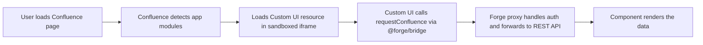

# Core Concepts: Forge for Confluence Cloud

This guide covers the fundamental concepts needed to build apps on Atlassian's Forge platform specifically for Confluence Cloud.

---

## What is Forge?

Forge is Atlassian's serverless development platform for building apps and integrations for Atlassian cloud products (Jira, Confluence, Bitbucket, Compass). Unlike the old Connect framework, Forge:

- **Serverless**: No infrastructure to manage — Atlassian handles everything
- **Managed runtime**: Your code runs in a secure, isolated environment (Node.js)
- **Built-in authentication**: OAuth handled automatically via manifest permissions
- **Rate-limited APIs**: Built-in rate limiting protection
- **Modern tooling**: CLI-based development with `forge` commands
- **Secure by default**: Apps run in a sandboxed environment with no direct internet access unless explicitly configured via `permissions.external`

---

## Confluence Forge Architecture

```
┌─────────────────────────────────────────────────────────────┐
│                    Confluence UI                            │
│  ┌─────────────┐  ┌──────────────┐  ┌──────────────────┐   │
│  │ Content      │  │ Custom UI    │  │ Space Settings   │   │
│  │ Byline Item  │  │ (iframe)     │  │ Panel            │   │
│  └─────────────┘  └──────────────┘  └──────────────────┘   │
└─────────────────────────────────────────────────────────────┘
                              │
                    ┌─────────┴─────────┐
                    │  @forge/bridge     │
                    │  (requestConfluence)│
                    └─────────┬─────────┘
                              │
┌─────────────────────────────────────────────────────────────┐
│                   Forge Runtime                             │
│  ┌───────────────────────────────────────────────────────┐  │
│  │  Serverless Functions (your backend code)             │  │
│  │  - Resolver functions (@forge/api)                    │  │
│  │  - Trigger handlers                                   │  │
│  │  - Scheduled triggers                                 │  │
│  └───────────────────────────────────────────────────────┘  │
└─────────────────────────────────────────────────────────────┘
                              │
                              ▼
┌─────────────────────────────────────────────────────────────┐
│              Confluence REST API v2                         │
│  https://{domain}.atlassian.net/wiki/api/v2                │
└─────────────────────────────────────────────────────────────┘
```

---

## Key Components

### 1. Manifest (`manifest.yml`)

The manifest defines your app's configuration. Here is a verified example using `confluence:contentAction`:

```yaml
app:
  id: ari:cloud:ecosystem::app/your-app-id
  runtime:
    name: nodejs24.x

permissions:
  scopes:
    - read:confluence-content.summary
    - write:confluence-content

modules:
  confluence:contentAction:
    - key: my-content-action
      resource: main
      resolver:
        function: resolver
      title: My Content Action
  function:
    - key: resolver
      handler: index.handler

resources:
  - key: main
    path: static/my-app/build
```

**Key manifest rules:**
- The top-level key is `resources:` (plural), not `resource:`
- Custom UI resources point to build output directories (e.g., `static/my-app/build`)
- UI Kit resources point to source files (e.g., `src/frontend/index.jsx`)
- Always include `app.runtime.name` (e.g., `nodejs24.x`)

### 2. Modules

Modules are the building blocks of your app. Below are the **verified** Confluence Forge modules:

**UI modules:**

| Module Type | Description |
|-------------|-------------|
| `macro` | Insert dynamic content into pages/blogs via the editor. One of the most common Confluence modules. |
| `confluence:contentAction` | Menu item in "more actions" (•••) for pages/blogs. Opens a modal dialog. |
| `confluence:contextMenu` | Context menu entry when text is selected on a page or blog. |
| `confluence:contentBylineItem` | Displays information in the content byline area below the page title (next to contributor metadata). |
| `globalSettings` | Top-level settings panel, accessible from the Confluence administration area. **Note:** Use `globalSettings` without prefix for site-wide admin settings. |
| `spacePage` | A page scoped to a specific space, appearing as a link in space navigation. **Note:** Use `spacePage` without prefix for space-scoped pages. |
| `globalPage` | A page accessible globally via the "Apps" section of the main navigation menu. **Note:** Use `globalPage` without prefix for global navigation items. |
| `confluence:homepageFeed` | Adds a content section to the right panel of the Confluence Home page. |
| `confluence:pageBanner` | Adds a banner to Confluence pages for displaying information or notifications. |
| `confluence:customContent` | Create custom content types that integrate with existing structures and support search/indexing. |

**Non-UI (background) modules:**

| Module Type | Description |
|-------------|-------------|
| `confluence:backgroundScript` | Allows apps to run in the background of a Confluence page. |
| `confluence:contentProperty` | Defines content properties which are indexed in CQL. |

**Trigger and function modules (not Confluence-specific):**

| Module Type | Description |
|-------------|-------------|
| `trigger` | Subscribes to product events (e.g., `avi:confluence:created:page`). |
| `scheduledTrigger` | Runs a function on a cron-like schedule. |
| `function` | Defines a serverless backend function handler. |

### 3. Resources

Resources are the static files that make up your Custom UI app:
- **Custom UI**: React components built and bundled (referenced via build directory path)
- **UI Kit**: React components using Atlassian UI Kit (referenced via source file path, rendered with `render: native`)
- **Static assets**: Icons, images referenced in manifest

---

## Custom UI vs. UI Kit

Forge offers two UI approaches for Confluence modules:

| Feature | Custom UI | UI Kit |
|---------|-----------|--------|
| Rendering | Runs inside a sandboxed iframe | Native Atlassian rendering |
| Framework | Any React-based framework | `@forge/react` Atlassian UI Kit components |
| Frontend API calls | `requestConfluence()` from `@forge/bridge` | `invoke()` from `@forge/bridge` to call resolver functions |
| Backend API calls | Resolver functions using `api.asUser()`/`api.asApp()` from `@forge/api` | Resolver functions using `api.asUser()`/`api.asApp()` from `@forge/api` |
| Manifest | `resource: main` (points to build dir) | `resource: main` + `render: native` (points to source file) |
| Flexibility | Full control over UI | Constrained to Atlassian design system |

---

## Custom UI Lifecycle



### The Custom UI Pattern (Frontend API Calls)

For Custom UI apps, use `requestConfluence()` from `@forge/bridge` to make API calls. Forge handles authentication automatically via the proxy mechanism.

```jsx
import React, { useEffect, useState } from 'react';
import { requestConfluence } from '@forge/bridge';

export default function PageExtension() {
  const [pages, setPages] = useState(null);

  useEffect(() => {
    async function fetchData() {
      // requestConfluence handles auth automatically via Forge proxy
      const response = await requestConfluence(`/wiki/api/v2/pages?title=My+Page&space-id=12345`);
      
      if (response.ok) {
        const result = await response.json();
        setPages(result.results);
      }
    }
    
    fetchData();
  }, []);

  return <div>{/* Your UI here */}</div>;
}
```

**Important**: Do NOT import `@forge/api` (backend-only package) in Custom UI components. Use `@forge/bridge` for all frontend API calls.

### The Resolver Pattern (Backend API Calls)

For UI Kit apps or when you need backend processing, use resolver functions with `@forge/api`. On the frontend, call resolvers using `invoke()` from `@forge/bridge`:

```js
// src/resolvers/index.js (backend)
import Resolver from '@forge/resolver';
import api, { route } from '@forge/api';

const resolver = new Resolver();

resolver.define('getPages', async ({ payload, context }) => {
  const response = await api.asUser().requestConfluence(route`/wiki/api/v2/pages?space-id=${context.spaceId}`);
  const data = await response.json();
  return data.results;
});

export const handler = resolver.getDefinitions();
```

```js
// src/frontend/index.jsx (frontend - invoking the resolver)
import { invoke } from '@forge/bridge';

const pages = await invoke('getPages', { /* payload */ });
```

---

## Content Types in Confluence Forge

### Page (`page`)
The most common content type. Custom UI can be added to any page via modules like `confluence:contentBylineItem` or `confluence:contentAction`.

### Blog Post (`blogpost`)
Blog posts also support custom UI. Modules like `confluence:contentAction` work on both pages and blog posts.

### Space (`space`)
Space-level configuration via `confluence:spaceSettings` module.

### Whiteboard (`whiteboard`)
Collaborative whiteboards. Supported by event triggers (e.g., `avi:confluence:created:whiteboard`) but with limited direct API support.

### Database (`database`)
Confluence databases. Supported by event triggers (e.g., `avi:confluence:created:database`).

### Custom Content
Apps can create their own custom content types using Forge's custom content module. Events: `avi:confluence:created:custom_content`, `avi:confluence:updated:custom_content`, etc.

---

## REST API v2 Overview

The Confluence REST API v2 is the current standard:

```
Base URL: https://{domain}.atlassian.net/wiki/api/v2
```

**Key endpoints:**

| Endpoint | Description |
|----------|-------------|
| `GET /pages` | List pages (filter by `space-id`, `title`, `status`) |
| `GET /pages/{id}` | Get a specific page |
| `POST /pages` | Create a new page |
| `PUT /pages/{id}` | Update an existing page |
| `DELETE /pages/{id}` | Delete (trash) a page |
| `GET /pages/{id}/children` | Get child pages |
| `GET /pages/{id}/footer-comments` | Get footer comments for a page |
| `GET /pages/{id}/inline-comments` | Get inline comments for a page |
| `GET /pages/{id}/versions` | Get page version history |
| `GET /pages/{id}/operations` | Get permitted operations for a page |
| `GET /pages/{id}/properties` | Get content properties for a page |
| `GET /blogposts` | List blog posts |
| `POST /blogposts` | Create a blog post |
| `GET /blogposts/{id}` | Get a specific blog post |
| `PUT /blogposts/{id}` | Update a blog post |
| `DELETE /blogposts/{id}` | Delete (trash) a blog post |
| `GET /spaces` | List spaces |
| `GET /spaces/{id}` | Get a specific space |
| `POST /spaces` | Create a new space |
| `GET /spaces/{id}/pages` | Get pages in a space |
| `GET /spaces/{id}/properties` | Get space properties |
| `GET /spaces/{id}/permissions` | Get space permissions |

**Authentication in Forge:**
- **Custom UI (frontend)**: Use `requestConfluence()` from `@forge/bridge` — Forge proxy handles OAuth automatically
- **Resolver functions (backend)**: Use `api.asUser()` or `api.asApp()` from `@forge/api` — token exchange handled automatically
- **External apps**: OAuth 2.0 (3LO) with explicit token management

---

## Permissions & Scopes

Confluence Forge apps require specific OAuth scopes in the manifest. Scopes come in two formats:
- **Classic scopes**: `action:product-resource` (e.g., `read:confluence-content.summary`)
- **Granular scopes**: `action:resource:product` (e.g., `read:space:confluence`)

Both formats are valid and can be mixed. Granular scopes are preferred for new apps.

```yaml
permissions:
  scopes:
    # Classic scopes
    - read:confluence-content.summary   # Read page/blogpost summaries
    - read:confluence-content.all       # Read all content (needed for task events)
    - write:confluence-content           # Create/update content
    - read:confluence-user               # Read user information
    # Granular scopes
    - read:space:confluence              # Read space information
    - write:space:confluence             # Write space properties
    - read:comment:confluence            # Read comments
    - write:comment:confluence           # Create/update comments
    - read:page:confluence               # Read pages (granular)
    - write:page:confluence              # Create/update pages (granular)
  external:
    fetch:
      backend:
        - https://api.example.com        # Allow backend calls to external APIs
```

**Key points about scopes:**
- Scopes grant *potential* access — Confluence permissions still apply (a user without page edit permission can't edit even if the app has `write:confluence-content`)
- Use `forge lint --fix` to auto-detect and add required scopes
- After changing scopes, run `forge deploy` then `forge install --upgrade`
- Some scopes imply other scopes automatically

---

## Event Types for Triggers

Forge uses the `trigger` module to subscribe to Confluence product events. Event names follow the pattern `avi:confluence:<action>:<content-type>`:

**Pages, live docs, and blog posts** (scope: `read:confluence-content.summary`):

| Event | Description |
|-------|-------------|
| `avi:confluence:created:page` | New page created |
| `avi:confluence:updated:page` | Page content changed |
| `avi:confluence:viewed:page` | Page viewed |
| `avi:confluence:trashed:page` | Page moved to trash |
| `avi:confluence:restored:page` | Page restored from trash |
| `avi:confluence:deleted:page` | Page permanently deleted |
| `avi:confluence:archived:page` | Page archived |
| `avi:confluence:unarchived:page` | Page unarchived |
| `avi:confluence:moved:page` | Page moved to another location |
| `avi:confluence:copied:page` | Page copied |
| `avi:confluence:permissions_updated:page` | Page permissions changed |
| `avi:confluence:created:blogpost` | New blog post published |
| `avi:confluence:updated:blogpost` | Blog post updated |

**Comments** (scope: `read:confluence-content.summary`):

| Event | Description |
|-------|-------------|
| `avi:confluence:created:comment` | Comment added |
| `avi:confluence:updated:comment` | Comment edited |
| `avi:confluence:liked:comment` | Comment liked |
| `avi:confluence:deleted:comment` | Comment deleted |

**Attachments** (scope: `read:confluence-content.summary`):

| Event | Description |
|-------|-------------|
| `avi:confluence:created:attachment` | Attachment uploaded |
| `avi:confluence:updated:attachment` | Attachment updated |
| `avi:confluence:viewed:attachment` | Attachment viewed |
| `avi:confluence:trashed:attachment` | Attachment trashed |
| `avi:confluence:restored:attachment` | Attachment restored |
| `avi:confluence:deleted:attachment` | Attachment permanently deleted |
| `avi:confluence:archived:attachment` | Attachment archived |
| `avi:confluence:unarchived:attachment` | Attachment unarchived |

**Inline tasks** (scope: `read:confluence-content.all`):

| Event | Description |
|-------|-------------|
| `avi:confluence:created:task` | Task created |
| `avi:confluence:updated:task` | Task status changed |
| `avi:confluence:removed:task` | Task removed |

**Whiteboards, databases, smart links (embeds), and folders** (scope: `read:confluence-content.summary`):

| Event | Description |
|-------|-------------|
| `avi:confluence:created:whiteboard` | Whiteboard created |
| `avi:confluence:moved:whiteboard` | Whiteboard moved |
| `avi:confluence:copied:whiteboard` | Whiteboard copied |
| `avi:confluence:permissions_updated:whiteboard` | Whiteboard permissions changed |
| `avi:confluence:created:database` | Database created |
| `avi:confluence:moved:database` | Database moved |
| `avi:confluence:copied:database` | Database copied |
| `avi:confluence:permissions_updated:database` | Database permissions changed |
| `avi:confluence:created:embed` | Smart link created in content tree |
| `avi:confluence:moved:embed` | Smart link moved |
| `avi:confluence:copied:embed` | Smart link copied |
| `avi:confluence:created:folder` | Folder created |
| `avi:confluence:moved:folder` | Folder moved |
| `avi:confluence:copied:folder` | Folder copied |
| `avi:confluence:permissions_updated:folder` | Folder permissions changed |

**Relations** (scopes: `read:confluence-content.summary`, `read:confluence-space.summary`, `read:confluence-user`):

| Event | Description |
|-------|-------------|
| `avi:confluence:created:relation` | Relationship between entities created |
| `avi:confluence:deleted:relation` | Relationship between entities deleted |

**Spaces** (scope: `read:confluence-space.summary`):

| Event | Description |
|-------|-------------|
| `avi:confluence:created:space:V2` | New space created |

**Users** (scope: `read:confluence-user`):

| Event | Description |
|-------|-------------|
| `avi:confluence:created:user` | User created |
| `avi:confluence:deleted:user` | User deleted |

**Groups** (scope: `read:confluence-groups`):

| Event | Description |
|-------|-------------|
| `avi:confluence:created:group` | Group created |

**Manifest example for a trigger:**

```yaml
modules:
  trigger:
    - key: page-created-trigger
      function: onPageCreated
      events:
        - avi:confluence:created:page
  function:
    - key: onPageCreated
      handler: index.onPageCreated
```

**Required scope for most content events:** `read:confluence-content.summary`

---

## Development Workflow

```bash
# 1. Install Forge CLI
npm install -g @forge/cli

# 2. Login to Atlassian account
forge login

# 3. Create new project (interactive template selection)
forge create

# 4. Navigate to your project
cd your-app-name

# 5. Deploy your app
forge deploy

# 6. Install the app on a Confluence site
forge install

# 7. Local development (with tunnel for hot-reload)
forge tunnel

# After manifest scope changes:
forge deploy
forge install --upgrade

# Auto-fix scope issues:
forge lint --fix
```

**There is no `forge register` command** — use `forge install` to register your app on a site.

---

## Next Steps

- [Page Custom UI](02-page-custom-ui.md) - Build page extensions
- [Webhooks & Events](07-webhooks-events.md) - Handle Confluence events  
- [CLI Commands](08-cli-commands.md) - Complete CLI reference